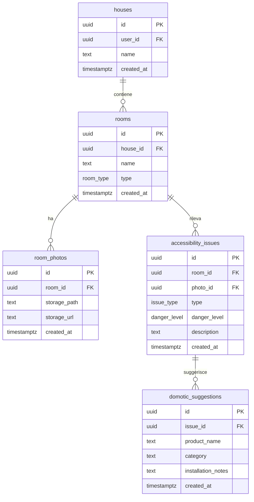
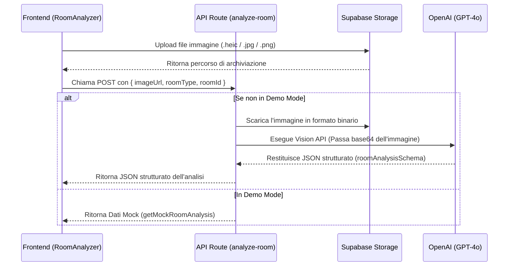

# Documentazione Tecnica di Progetto

## PWA Abbattimento Barriere Architettoniche & Domotica Assistiva

Questa documentazione fornisce una panoramica architetturale e tecnica dettagliata del prototipo PWA, progettata per facilitare l'onboarding e il lavoro di sviluppo del team di ingegneria.

---

## 1. Architettura Tecnologica (Tech Stack)

L'applicazione è sviluppata seguendo un'architettura full-stack serverless integrata su framework Next.js e piattaforma Supabase:

* **Core Framework:** Next.js (App Router, React 19, TypeScript).
* **Styling & Design System:** Tailwind CSS v4.0 con configurazione basata su variabili CSS in `globals.css` (estetica minimale, angoli arrotondati, palette ad alto contrasto per accessibilità).
* **Database & Auth:** Supabase Database (PostgreSQL) con integrazione del client SSR (`@supabase/ssr`).
* **File Storage:** Supabase Storage per il caricamento delle immagini delle stanze da analizzare.
* **AI Engine:** Integrazione con Vercel AI SDK (`ai` e `@ai-sdk/openai`) per l'interazione strutturata con il modello OpenAI `gpt-4o` (Vision).

---

## 2. Schema del Database (PostgreSQL)

Il database è strutturato su tabelle relazionali nel Public schema, protette tramite politiche di isolamento Row Level Security (RLS).

### Diagramma Entità-Relazione (ER) logico


### Tipi Custom (Enum)
* `room_type`: `'bagno'`, `'cucina'`, `'camera'`, `'soggiorno'`, `'ingresso'`, `'corridoio'`, `'scale'`, `'garage'`, `'altro'`.
* `danger_level`: `'low'` (miglioramento consigliato), `'medium'` (barriera significativa), `'high'` (rischio sicurezza immediato).
* `issue_type`: `'altezza_interruttori'`, `'larghezza_porta'`, `'gradino'`, `'assenza_maniglione'`, `'spazio_manovra'`, `'pavimento_scivoloso'`, `'illuminazione_insufficiente'`, `'ostacolo_mobile'`, `'ostacolo_fisso'`, `'accesso_vasca_doccia'`, `'altro'`.

### Politiche di Sicurezza (Row Level Security)
Tutte le tabelle hanno RLS attivo (`ALTER TABLE ... ENABLE ROW LEVEL SECURITY`). L'isolamento logico si basa sul proprietario dell'abitazione (`auth.uid() = user_id`):
1. **`houses`:** Operazioni CRUD consentite solo se il `user_id` corrisponde a `auth.uid()`.
2. **`rooms` e dipendenti:** Operazioni CRUD regolate tramite join annidate che risalgono alla tabella `houses` per verificare la corrispondenza del `user_id` con `auth.uid()`.

---

## 3. Gestione Storage & Upload

Le foto delle stanze vengono memorizzate in un bucket privato Supabase chiamato `room-photos`.

* **Archiviazione:** I percorsi all'interno del bucket sono partizionati per ID utente e ID stanza: `{user_id}/{room_id}/{uuid}.{ext}`.
* **Sicurezza Bucket:**
  * L'upload (`INSERT`) e il download (`SELECT`) degli oggetti in `storage.objects` sono limitati agli utenti autenticati e ristretti al percorso che inizia con il proprio `auth.uid()`.
  * Per motivi di sicurezza legati all'API Vision di OpenAI, l'applicazione genera un URL firmato temporaneo (validità di 1 ora) tramite `createSignedUrl` anziché esporre un URL pubblico a tempo indeterminato.

---

## 4. Pipeline di Analisi AI (Vision)

La funzionalità principale è gestita dall'endpoint API `POST /api/analyze-room`.

### Flusso Logico delle Chiamate


### Prompt di Sistema e Schema dei Dati (Zod)
Il modello `gpt-4o` viene interpellato tramite `generateObject` per forzare l'aderenza strutturata allo schema Zod `roomAnalysisSchema`:
```typescript
export const roomAnalysisSchema = z.object({
  summary: z.string().describe("Sintesi in italiano chiaro per famiglia e installatore (2-4 frasi)"),
  issues: z.array(
    z.object({
      type: issueTypeSchema,
      danger_level: dangerLevelSchema,
      description: z.string(),
      domotic_suggestions: z.array(
        z.object({
          product_name: z.string(),
          category: z.string(),
          installation_notes: z.string().optional()
        })
      )
    })
  )
});
```

> [!WARNING]
> **Nota Tecnica per il Team (Bug Mismatch Bucket):**
> Nel file [route.ts](file:///c:/Users/giaco/GALILEO/Progetti/domotica-accessibilita-pwa/app/api/analyze-room/route.ts#L65) la funzione di download scarica dal bucket `'stanze'` (`supabase.storage.from('stanze').download(...)`).
> Tuttavia, nel file di migrazione delle policy [002_storage_policies.sql](file:///c:/Users/giaco/GALILEO/Progetti/domotica-accessibilita-pwa/supabase/migrations/002_storage_policies.sql#L4) e nel modulo di upload [upload-room-photo.ts](file:///c:/Users/giaco/GALILEO/Progetti/domotica-accessibilita-pwa/lib/storage/upload-room-photo.ts#L3), il bucket è configurato come `'room-photos'`.
>
> **Risoluzione Consigliata:** Sostituire `'stanze'` con `'room-photos'` nel file `app/api/analyze-room/route.ts` per evitare eccezioni di caricamento fallito in produzione.

---

## 5. Frontend & UI Architecture

Il frontend segue i principi dell'accessibilità WCAG combinati con un'estetica minimale ed estremamente pulita.

### Moduli Principali:
1. **`RoomAnalyzer` (`components/room-analyzer.tsx`):**
   * Gestisce il caricamento delle immagini lato client con filtri su formati ed estensioni.
   * Limita la dimensione del file a 10MB massimo.
   * Fornisce segnali semantici accessibili per i lettori di schermo (es. attributo `aria-busy` e un'area live region `aria-live="polite"` per annunciare le fasi di elaborazione).
2. **`AnalysisResults` (`components/analysis-results.tsx`):**
   * Mostra il report testuale complessivo della stanza.
   * Raggruppa visivamente le problematiche ordinate per livello di pericolo (`high`, `medium`, `low`).
   * Visualizza i suggerimenti domotici corrispondenti tramite badge categorizzati.

### Sistema di Design e Accessibilità (Contrasto e Arrotondamenti)
Per soddisfare le specifiche di design e contrasto visivo, sono stati impostati i seguenti parametri in `app/globals.css`:
* **Sfondo Pagina:** Azzurro ghiaccio minimale (`#eaf2fa`).
* **Testo Esterno:** Blu scuro (`#0f172a`) per massima leggibilità su fondo chiaro.
* **Card & Contenitori:** Sfondo blu navy scuro (`#111c2e`) con testi interni bianchi (`#ffffff`) per contrasto WCAG ottimale e isolamento visivo dei report.
* **Componenti Interattivi (Pulsanti):** Colore primario verde smeraldo (`#1aa47b`) con testi bianchi.
* **Bordi Arrotondati:** Raggio impostato a `1rem` (16px) per ammorbidire le geometrie delle card, dei campi select e dei bottoni.
* **Micro-interazioni:** Aggiunti stati di hover sui bottoni con transizioni morbide e un effetto attivo di micro-ridimensionamento al click (`active:scale-[0.98]`).

---

## 6. Configurazione Ambiente e Sviluppo Locale

### Prerequisiti
Creare un file `.env.local` nella cartella principale del progetto con le seguenti variabili d'ambiente:
```env
NEXT_PUBLIC_SUPABASE_URL=https://your-project-ref.supabase.co
NEXT_PUBLIC_SUPABASE_ANON_KEY=your-anon-key
OPENAI_API_KEY=your-openai-api-key
USE_MOCK_AI=false
```

### Installazione e Avvio
1. Installare le dipendenze:
   ```bash
   npm install
   ```
2. Applicare le migrazioni al database Supabase locale o remoto:
   ```bash
   supabase db push
   ```
3. Avviare l'ambiente di sviluppo:
   ```bash
   npm run dev
   ```
4. Eseguire la compilazione di produzione per testare la build:
   ```bash
   npm run build
   ```
